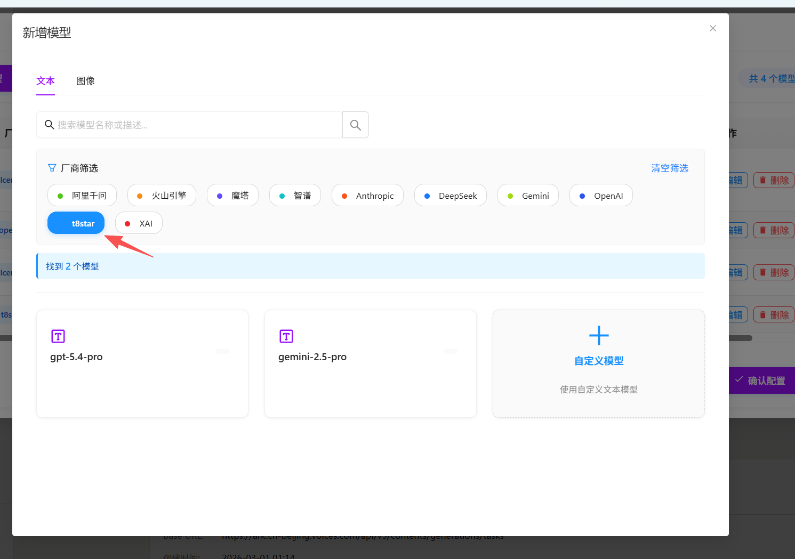
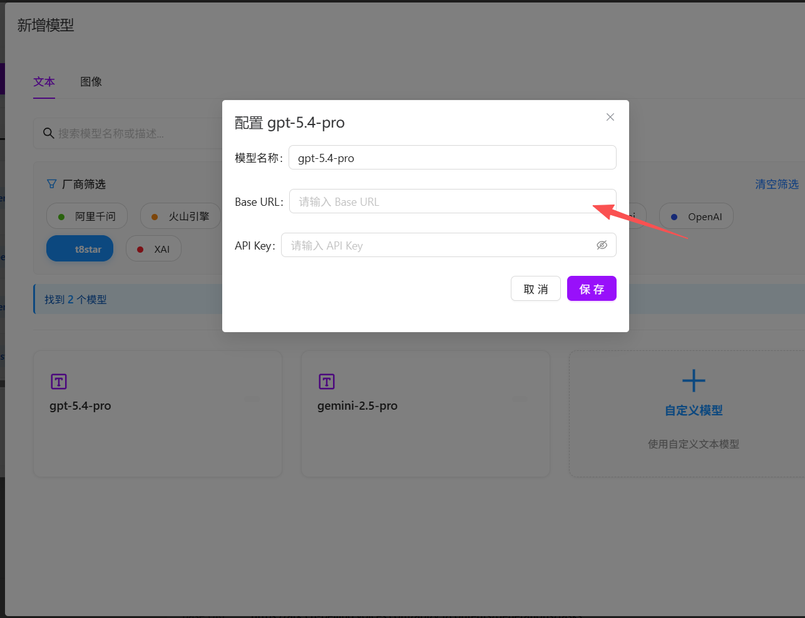
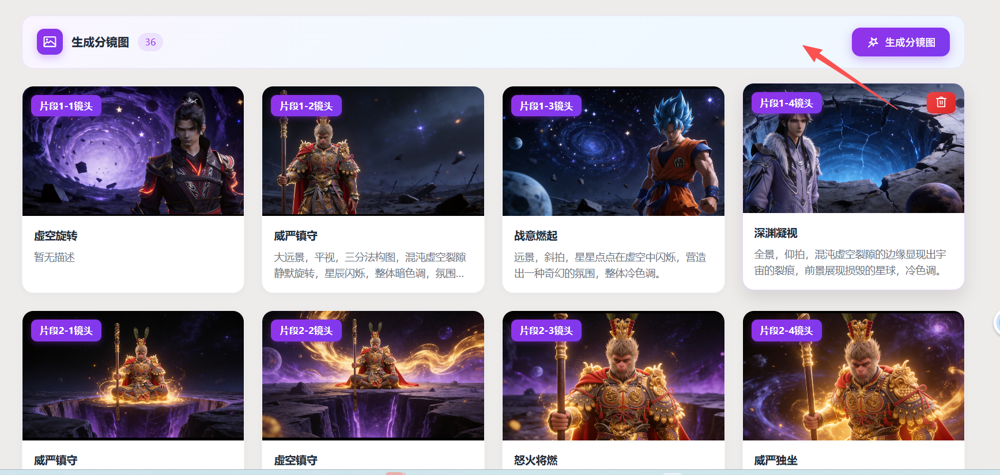
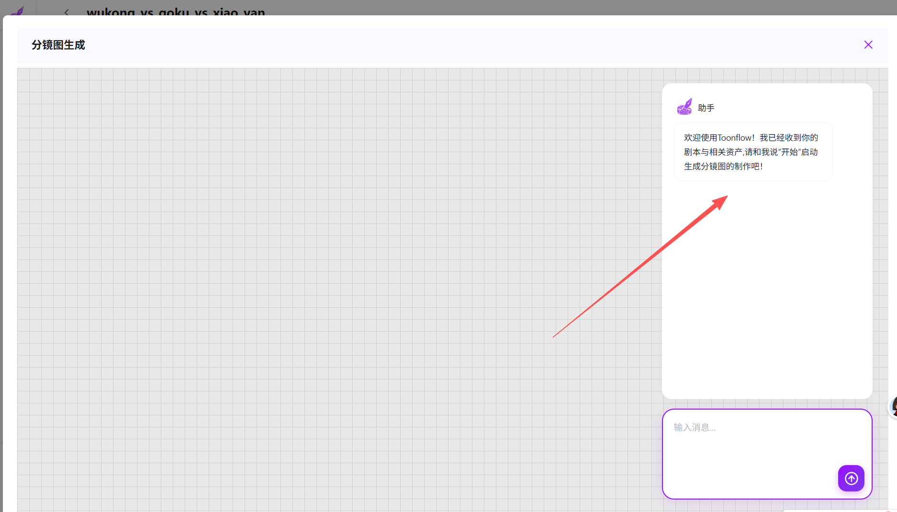
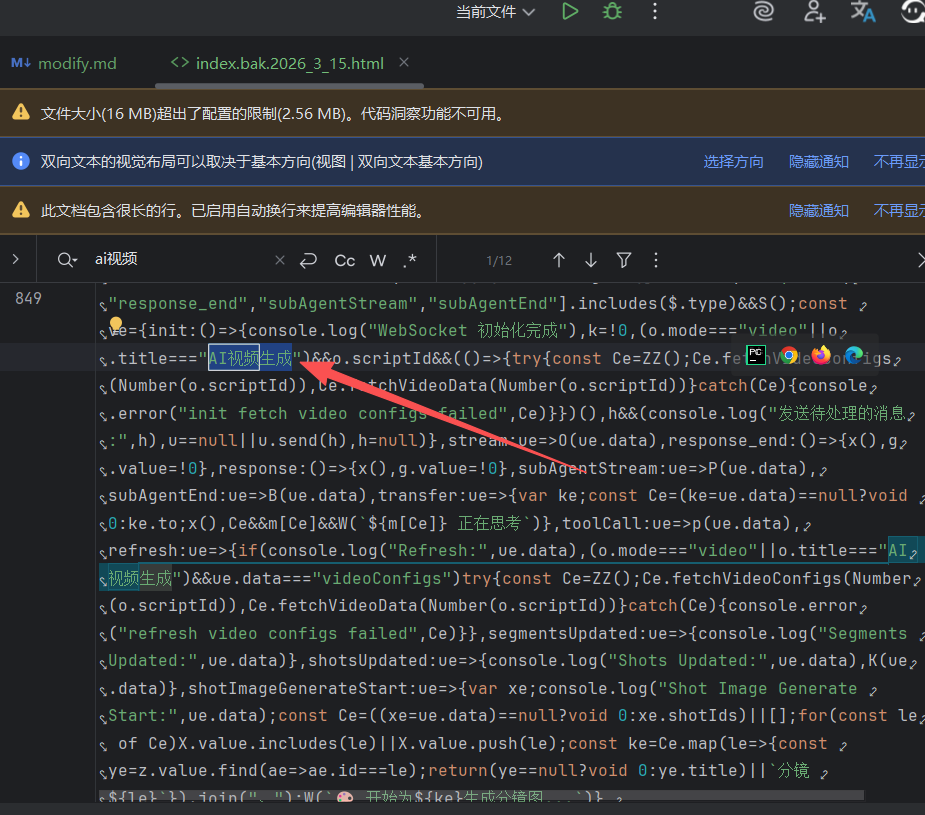
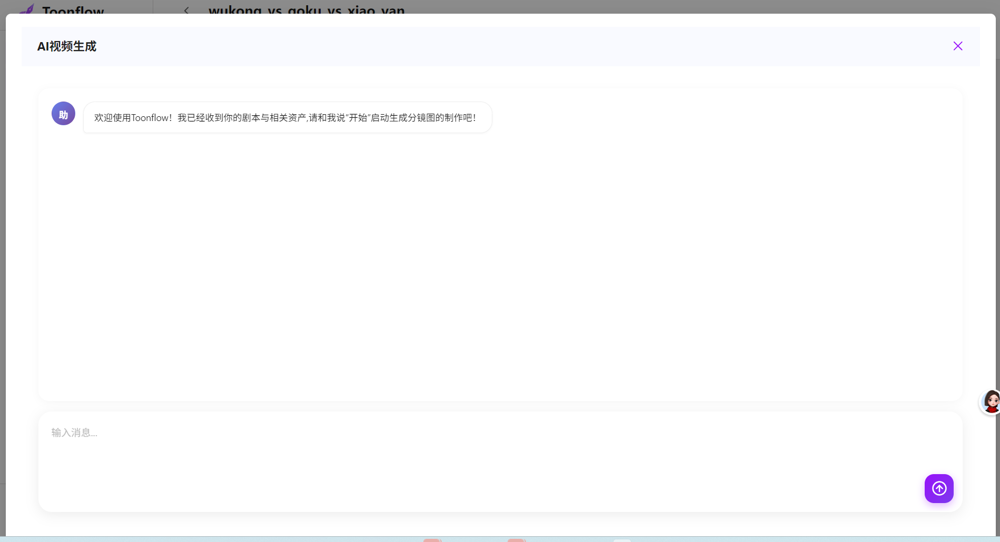
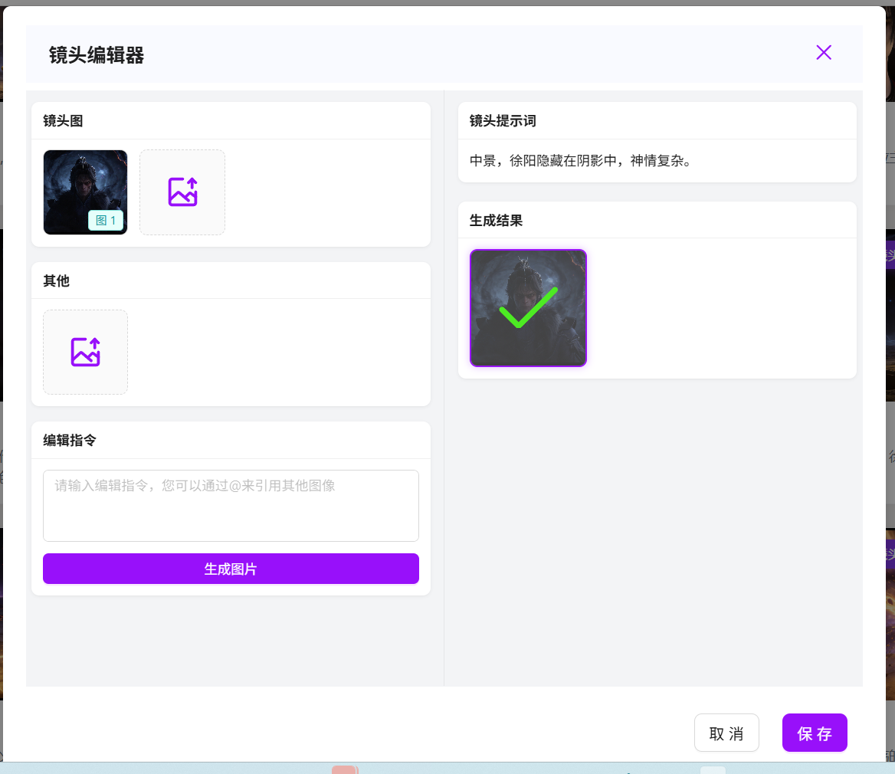
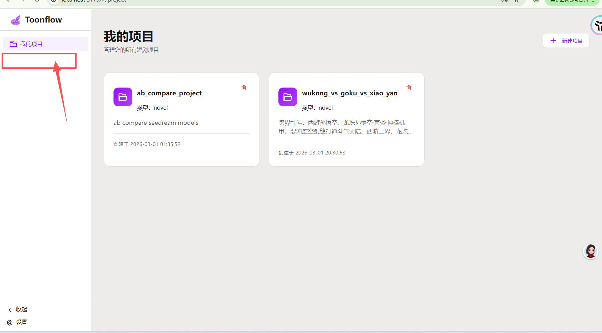

# no_modify
ai 要记录一些对应的内容,请记录在[modify.ai.md](modify.ai.md)
# 修复版本不一致的问题
参考：[md/modify_check/index.bak.2026_3_15.html]
1.t8star 厂家的baseurl 默认值缺少

2.分镜的“进入全选删除”按钮和对应功能的缺少

3.聊天历史的管理功能缺少，以及一系列的助手优化修改缺少

参考：[md/modify_check/index.bak.2026_3_15.html]
已对分镜生成画布做了优化和对话记录功能和助手的优化。
请查看：const $=`/storyboard/chatStoryboard?projectId 对应的处理
后端代码是：/mnt/d/Users/viaco/tools/toonflow-app-run/src/routes/storyboard/chatStoryboard.ts

4.AI视频生成 的对应功能的缺少，以及一系列的助手优化修改缺少
参考：[md/modify_check/index.bak.2026_3_15.html]
已对ai视频生成画布做了优化和对话记录功能和助手的优化。

- 以下是错误的实现

- 正确的实现是
参考：[md/modify_check/index.bak.2026_3_15.html]
AI视频生成》ai视频画布（标题：AI视频生成），视频专用的ai 助手和画布和聊天记录

5.镜头编辑器 的修改没有同步

这里不是最新的解决方案。
最新的方案是
镜头提示词可编辑。不会被编辑指令覆盖。
编辑指令和图片保存下来且不影响镜头提示词。

6.视频配置的“进入全选删除”按钮和对应功能的缺少
[index.bak.2026_3_15.html](index.bak.2026_3_15.html)

7.会话历史管理 功能缺少
