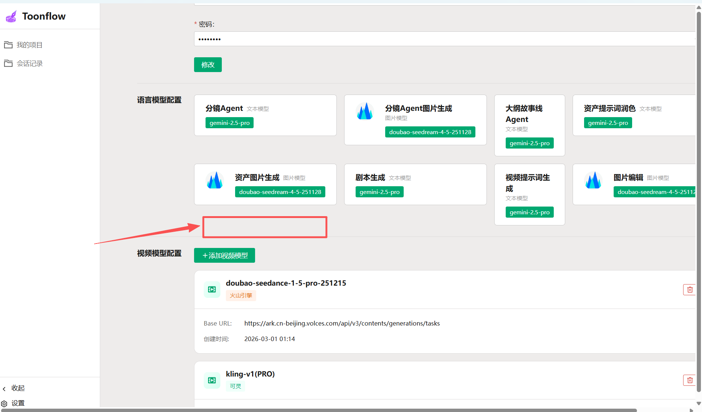
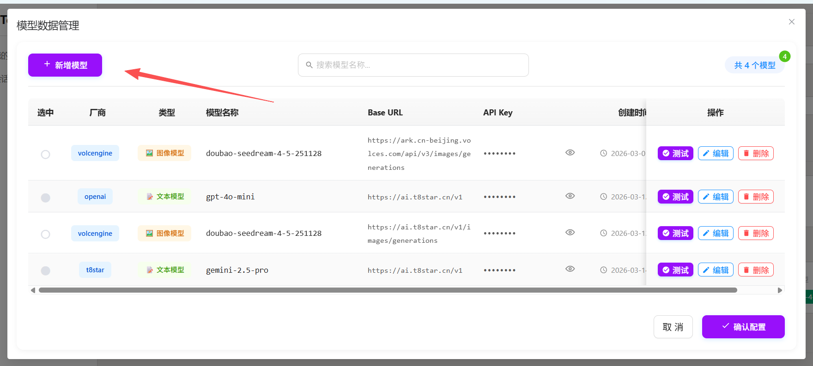
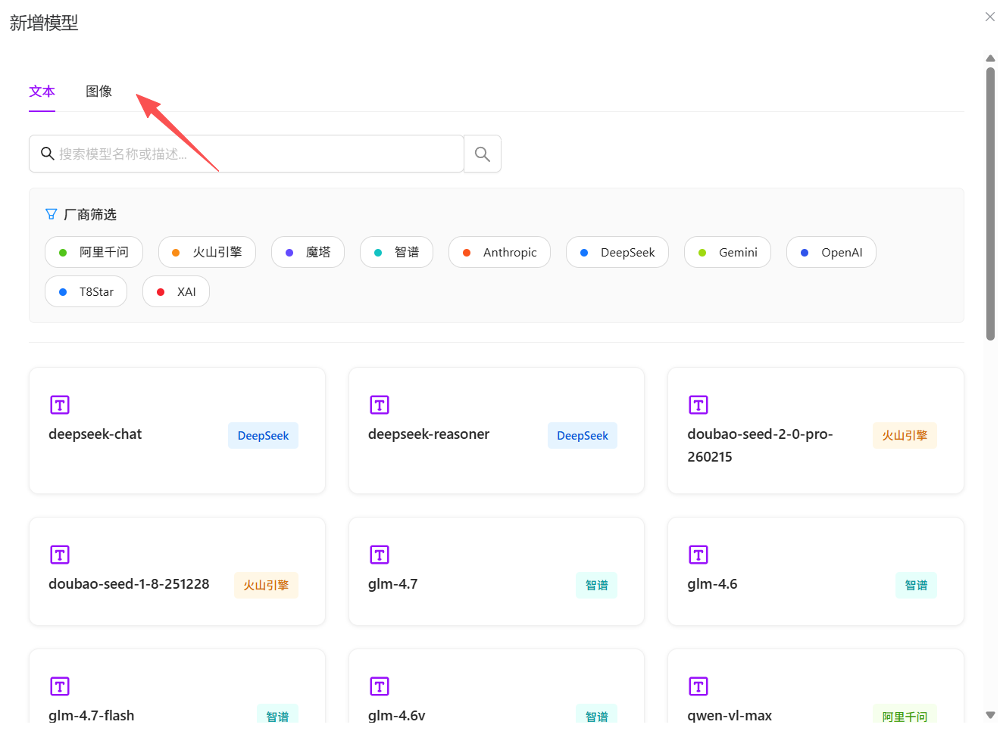
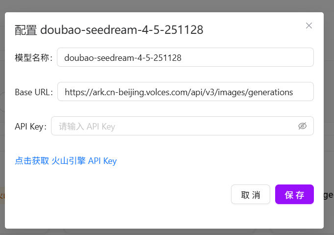
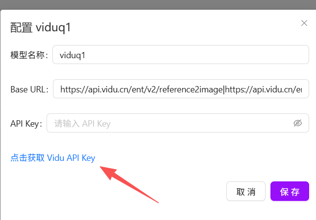
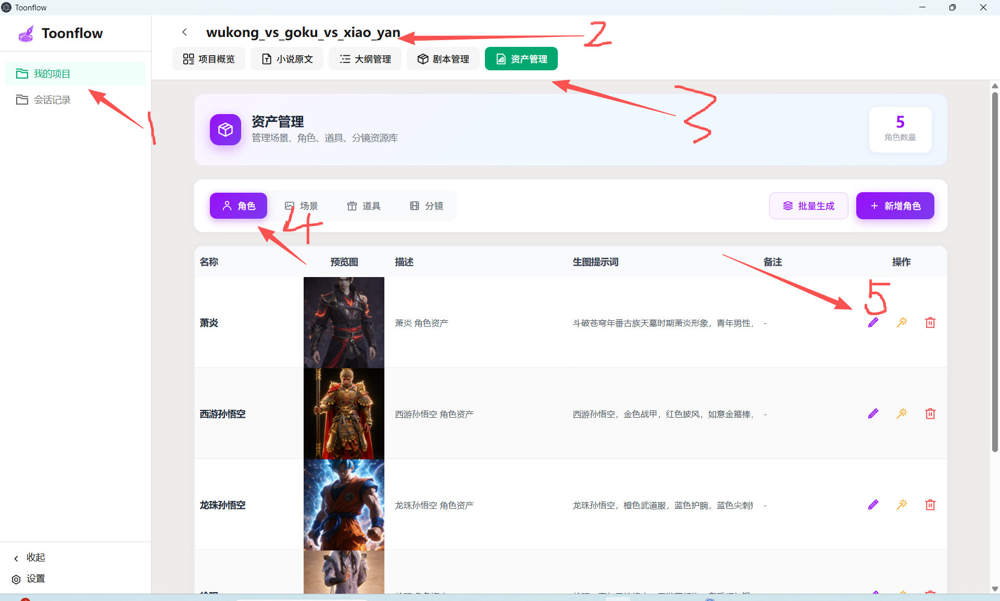
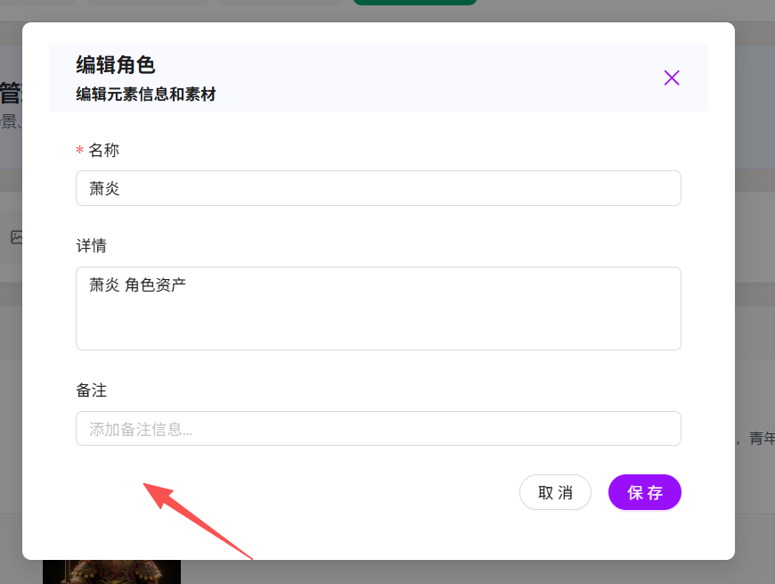
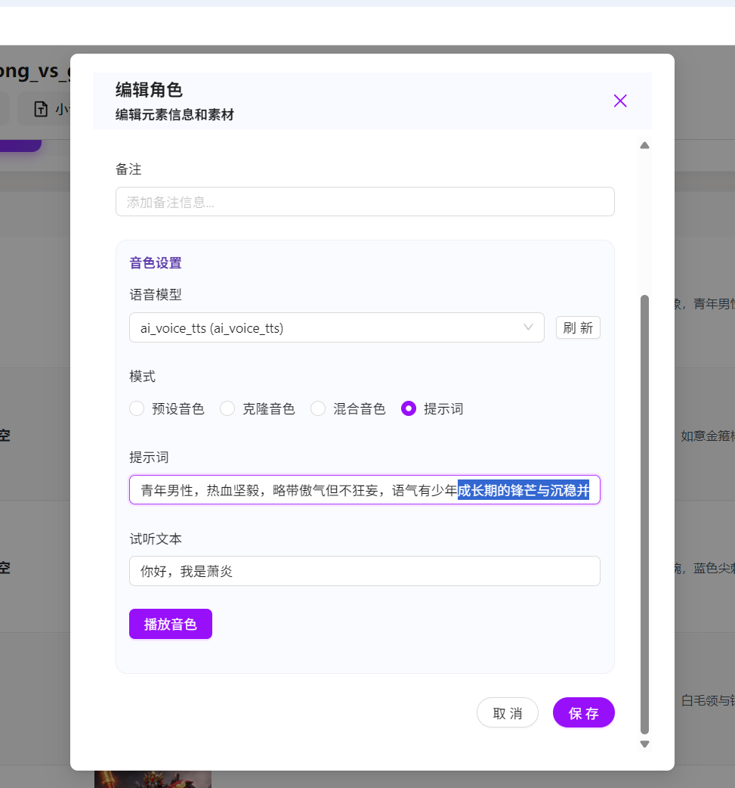

# 声音功能模块
通过接口对接语音接口,先对接的是local 语音接口(ai_voice_tts)。
跟图像模型一样可以选择厂商和模型然后进行对接。只是我们先只对接ai_voice_tts
# ai_voice_tts project [D:\Users\viaco\tools\voice]
[{ai_voice_tts}/md/apidoc.md]

## 语音生成模型接口 设置
设置>语音生成>新增模型>语音tts>厂商筛选>ai_voice_tts(厂商)>ai_voice_tts(模型)

一个类似下图的语音模型配置弹框

超链接: [https://github.com/viaco2ove/ai_voice_tts.git](ai_voice_tts)

# 设置角色的语音

角色编辑页，增加音色设置功能。链接语音模型进行音色声音。播放音色。
1.选择预设音色
2.上传音色文件，录入音色
3.混合音色（1到3 个音色 按不同比例进行混合）
4.根据提示词生成音色
6.选择角色的音色。

1.播放音色改为“试听”
2.提示词 旁边加多个 “ai润色”按钮 
可以把 用户输入的“萧炎” 润色为:"青年男性，热血坚毅，略带傲气但不狂妄，语气有少年成长期的锋芒与沉稳并存，咬字清晰，速度中等偏快，语气起伏明显，带一点江湖气和不服输的底气。"
3.增加音色下载功能。
这样提示词生成的音色就可以下载后作为克隆音色。 得到更稳定的音色效果。