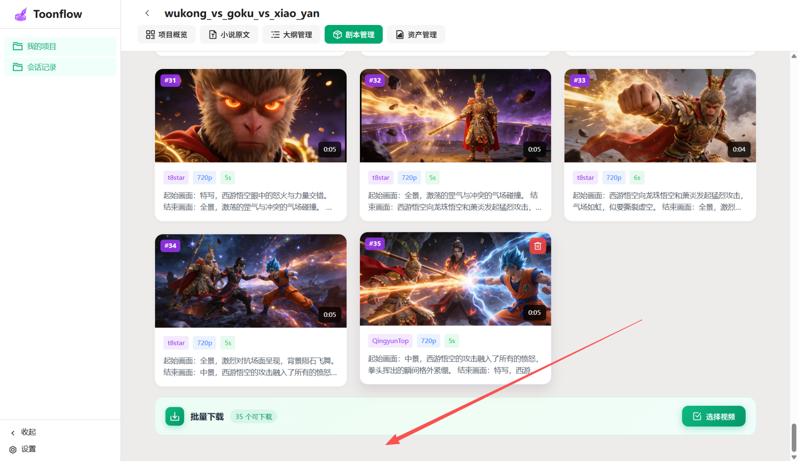
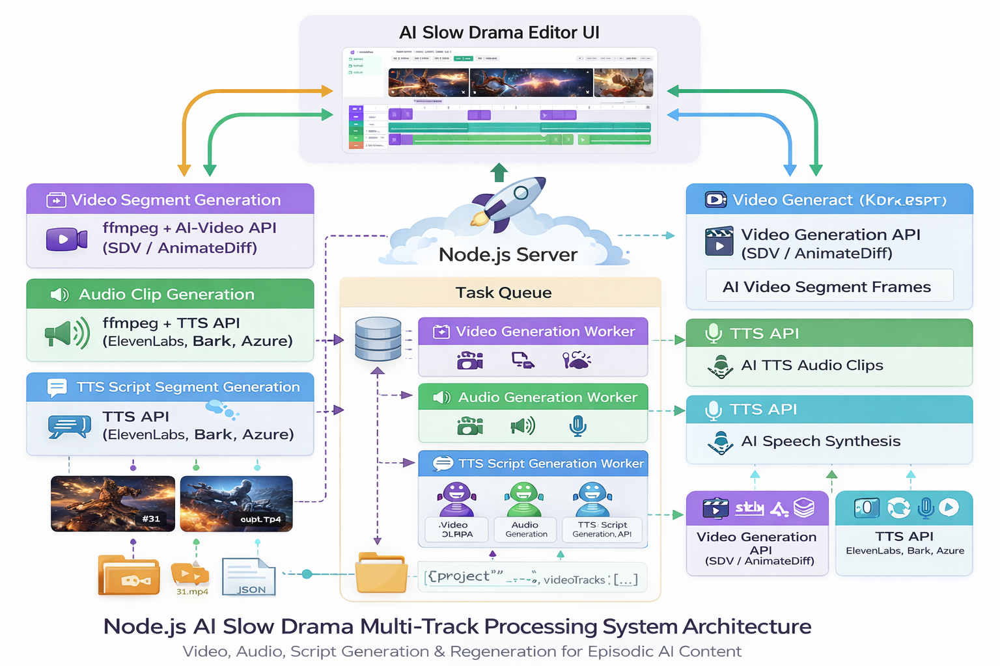
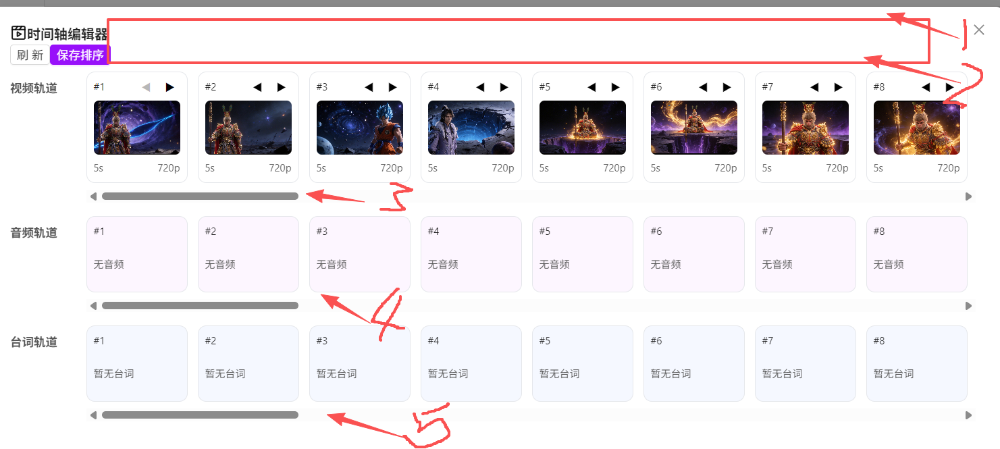
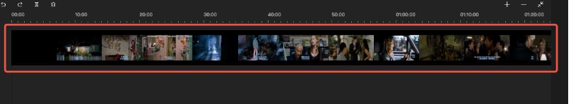
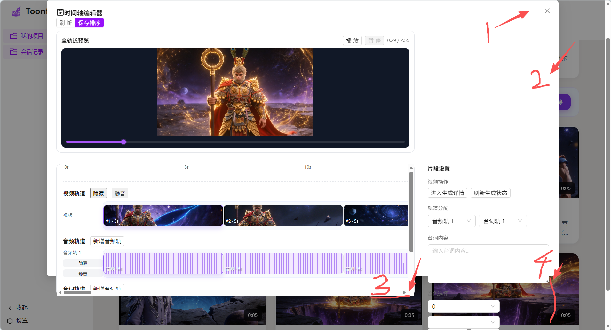

# no_modify

# 在这里实现一个剪影类似的视频编辑功能
针对ai 慢剧的。视频轨道（各个生成的视频按顺序加载到视频轨道，可以重新生成片段视频，可以重新生成分镜图片），音频轨道（可以提交片段视频的声音）。台词轨道（可以替换音频里的音色，或者重新生成台词语音）。

明白了，你的目标不是单纯的“剪影”视频处理，而是针对 **AI 慢剧（AI-generated episodic animation）** 的 **多轨道编辑和生成平台**。换句话说，你希望在 Node.js 环境下实现类似 Toonflow 的 **AI慢剧编辑器核心功能**，包括视频、音频、台词轨道的灵活生成和替换。我们可以从系统功能模块化来分析。

---

## **1️⃣ 系统功能拆解**

| 功能轨道     | 核心需求                    | Node.js 实现思路                                                                                                                                                             |
| -------- | ----------------------- | ------------------------------------------------------------------------------------------------------------------------------------------------------------------------ |
| **视频轨道** | 每个片段视频可以重新生成、调整顺序、生成分镜图 | - 使用 AI 图像/视频生成 API（如 Stable Diffusion Video / RunDiffusion / AnimateDiff）生成或更新帧<br>- 使用 `ffmpeg` 拼接片段、处理帧率和分辨率<br>- 可以生成每个片段对应的“分镜图”（关键帧截图）                             |
| **音频轨道** | 每个片段视频的声音可以单独替换或重新生成    | - 提取视频音频 `ffmpeg -i clip.mp4 -q:a 0 -map a audio.mp3`<br>- 使用 AI 语音生成 API（TTS）生成新的音频<br>- 将音频重新合成到视频 `ffmpeg -i clip.mp4 -i new_audio.mp3 -c:v copy -c:a aac output.mp4` |
| **台词轨道** | 可以替换音色或重新生成台词语音         | - 提供脚本台词输入<br>- 使用 TTS 模型（支持多种音色）生成音频片段<br>- 直接替换对应音频轨道                                                                                                                  |
| **分镜轨道** | 可以重新生成每个镜头的静态图或短视频片段    | - 对每个镜头调用 AI 图像生成 API<br>- 根据剧情脚本生成多镜头 Storyboard<br>- 用 `ffmpeg` 将静态分镜图转成短视频片段                                                                                          |

---

## **2️⃣ Node.js 技术栈建议**

* **视频处理**：`fluent-ffmpeg` 或直接调用 `ffmpeg` CLI
* **音频处理**：`ffmpeg` + `sox`（可选，用于音量、音色处理）
* **AI生成**：

  * 图像/分镜：`stable-diffusion` / `sd-webui` API
  * 视频：`animate-diffusion` 或逐帧生成
  * TTS（台词/音频）：`ElevenLabs` / `Bark` / `gTTS` / `Azure TTS API`
* **文件管理**：Node.js `fs` + `path`，保存每个轨道片段
* **任务调度**：`bull` / `bee-queue`（队列管理异步生成任务，防止阻塞）
* **前端交互**：

  * React / Vue / Svelte 可显示多轨道时间轴
  * 每个片段可点击“重新生成视频/台词/音频”

---

## **3️⃣ 数据结构建议**

每个慢剧项目可以用 JSON 管理轨道状态：

```json
{
  "projectId": "wukong_vs_goku_vs_xiao_yan",
  "videoTracks": [
    {"id": 31, "file": "31.mp4", "status": "generated"},
    {"id": 32, "file": "32.mp4", "status": "pending"}
  ],
  "audioTracks": [
    {"videoId": 31, "file": "31.mp3", "voice": "Goku", "status": "generated"}
  ],
  "scriptTracks": [
    {"videoId": 31, "text": "悟空怒吼！", "voice": "Goku", "status": "generated"}
  ]
}
```

* 这样可以动态重新生成单个片段，而不破坏其他轨道。
* 可以针对每条轨道发起异步生成请求（Node.js + 队列）。

---

## **4️⃣ 关键功能 Node.js 实现思路示例**

### **视频轨道重新生成**

```js
const ffmpeg = require('fluent-ffmpeg');
const { generateVideoFromScript } = require('./aiVideoAPI'); // 伪函数

async function regenerateVideoSegment(segment) {
  // 调用 AI 生成视频帧
  const frames = await generateVideoFromScript(segment.script);

  // 使用 ffmpeg 合成帧成视频
  await new Promise((resolve, reject) => {
    ffmpeg()
      .input(`pipe:0`)
      .inputFormat('image2pipe')
      .outputOptions('-pix_fmt yuv420p', '-r 24')
      .save(segment.file)
      .on('end', resolve)
      .on('error', reject)
      .run();
  });
}
```

### **台词轨道重新生成**

```js
const { generateTTS } = require('./aiAudioAPI');

async function regenerateScriptAudio(scriptSegment) {
  const audioBuffer = await generateTTS(scriptSegment.text, scriptSegment.voice);
  fs.writeFileSync(scriptSegment.file, audioBuffer);
}
```

### **音频轨道替换**

```js
async function replaceAudioInVideo(videoFile, newAudioFile, outputFile) {
  await new Promise((resolve, reject) => {
    ffmpeg(videoFile)
      .input(newAudioFile)
      .outputOptions('-c:v copy', '-c:a aac')
      .save(outputFile)
      .on('end', resolve)
      .on('error', reject);
  });
}
```

---

💡 **总结**

* Node.js + FFmpeg + AI API 完全可以实现你说的慢剧编辑功能。
* 核心思路是**多轨道管理 + 异步生成 + 可替换轨道**。
* 前端可以像 Toonflow 一样展示时间轴，每个片段可以独立重新生成视频/台词/音频。

---

我可以帮你画一个 **Node.js AI慢剧多轨道处理的系统架构图**，让你清晰看到视频、音频、台词、分镜轨道如何互通和异步生成。

架构图:


# ui:

标1:视频预览播放（全轨道全片段）
标2:时间轴

可以左右拖动。设置播放起始位置。

标3，标4.标5 不需要这样的滚动条。用标2的时间轴控制就行

音频轨道和台词轨道直接显示为音频波形图。要跟时间刻度对齐。
每个视频片段的占时要跟刻度对齐。不是均匀的

音频轨道和台词轨道 都是多轨的而不是但轨道。

视频轨道的声音可以mute 掉。 其他轨道也是可以mute 掉的，
轨道可以说设置可视/不可视

如图：

- 标1 增加个全屏显示按钮
- 标2 增加上下滚动的滚动条
- 标3和标4 现在出界了需要标2 的那个滚动条
- 
# 未完成
“分镜图重生成”和“多音频切换”