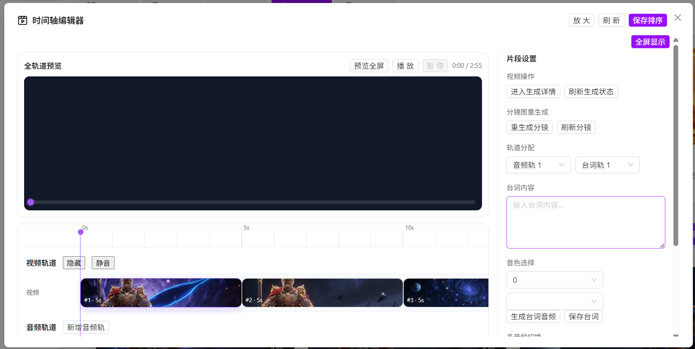
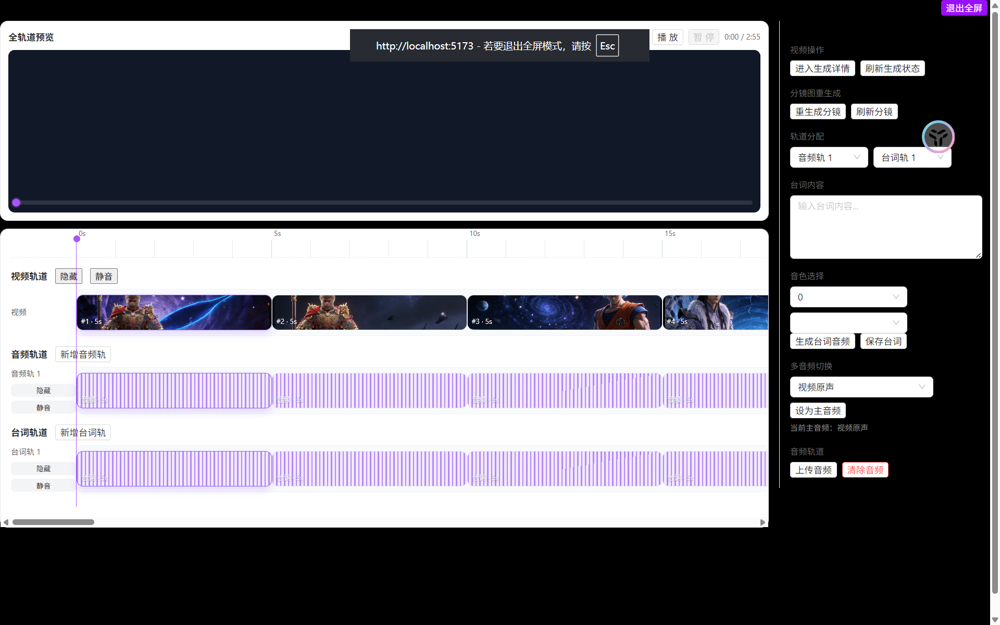
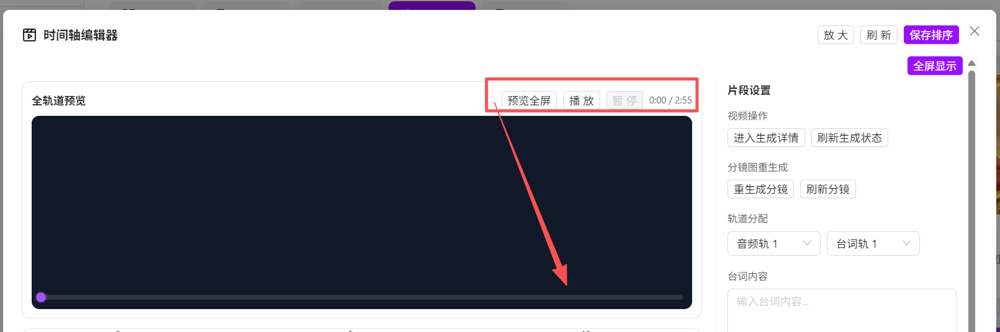
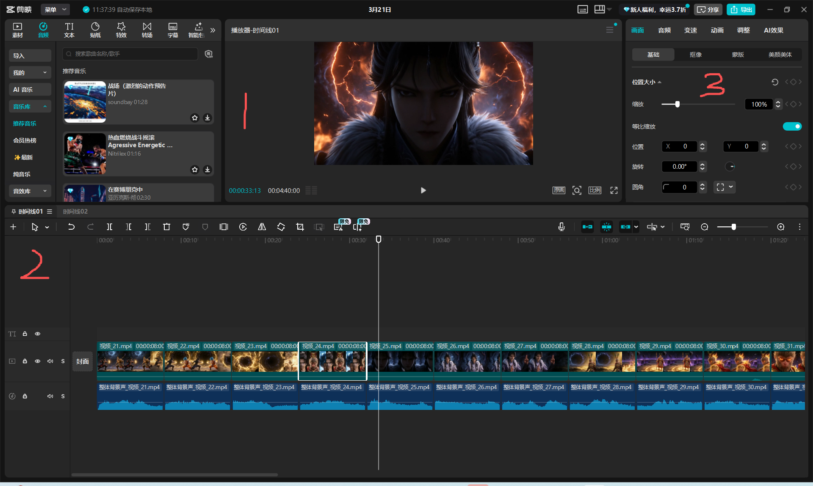
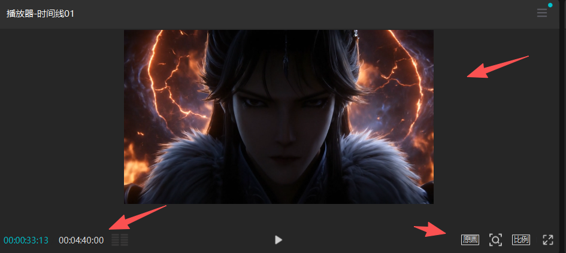

# Toonflow 时间轴编辑器 UI 设计审计（基于截图）

## 审计范围
- 依据：你提供的两张截图（普通弹窗模式 + 全屏模式）。
- 目标：解释“为什么界面看起来像一坨屎”，并给出可执行改版方案。
- 结论先行：问题不在“丑”本身，而在信息架构、视觉系统、交互优先级三者同时失控。

## 一句话结论
当前 UI 把“播放器”“时间轴编辑器”“生产任务控制台”三种产品形态硬塞到一个面板里，没有主任务聚焦，视觉语言还在模式切换时断裂，所以用户感知就是杂、挤、乱、难用。

## 分级问题清单

### P0（必须优先修）
1. **主任务不聚焦**  
   证据：右侧面板集中了“生成详情、刷新状态、重生成、轨道分配、台词、音色、上传音频”等多类操作，同层级显示。用户看不到“当前应该先做什么”。
2. **全屏不是编辑态，只是放大容器**  
   证据：全屏后仍保留拥挤侧栏和滚动条，视觉噪声上升，沉浸感下降。
3. **时间轴可读性弱**  
   证据：刻度线和片段边界对比不足；播放头细且存在感低；视频、音频、台词轨视觉区分不明显。
4. **视觉系统割裂**  
   证据：普通模式偏浅色，全屏模式右侧突变黑底；按钮、输入框、下拉尺寸与密度不一致，像不同页面拼接。

### P1（持续拖慢效率）
1. **控制项密度过高**：高风险按钮（刷新、重生成）与常规编辑按钮混排，误触成本高。  
2. **状态反馈缺失**：当前选中片段、正在编辑对象、禁用/可用关系不清晰。  
3. **滚动层级混乱**：面板内外同时滚动，注意力被打断。  
4. **轨道语义不清**：用户难快速理解“视频轨片段、音频轨版本、台词轨版本”的从属关系。

### P2（影响专业感）
1. 字号层级不稳定，标题/正文/注释对比弱。  
2. 轨道纹理（竖条）重复且高对比，噪声大于信息。  
3. 按钮文案风格不统一（动作、名词、状态混杂）。

## 根因
1. **信息架构错位**：编辑工作流（选片段 -> 调轨道 -> 预览 -> 保存）没有被界面显式表达。  
2. **缺少设计令牌系统**：颜色、间距、圆角、控件高度没有统一规则。  
3. **缺少“主次操作”分层**：关键动作与次要动作同权重。  
4. **全屏模式缺少独立布局策略**：只是样式切换，不是交互重排。

## 改版目标（对齐剪映式体验）
1. 任何时刻，用户能在 3 秒内看懂“当前编辑对象 + 下一步动作”。  
2. 时间轴成为绝对主角，右侧面板只显示当前对象相关配置。  
3. 普通/全屏共用同一视觉系统，只改变信息密度，不改变语言。

## 可执行改版方案

### 1) 版式重构（先做）
- 顶部：仅保留播放控制、缩放、保存。
- 中部：左 70% 预览 + 时间轴，右 30% 属性面板。
- 右侧面板改成 **三段折叠**：`片段`、`音频`、`台词`，一次只展开一个。
- 全屏模式默认隐藏右侧面板，按 `Tab` 或按钮唤出。

### 2) 轨道视觉重构（核心）
- 每条轨道固定结构：`轨道头（名称/静音/隐藏） + 轨道体（clip）`。
- 视频/音频/台词使用三种低饱和色系；选中 clip 用高亮描边 + 阴影。
- 播放头改为高对比竖线 + 顶部时间泡；刻度每 1s 主刻度、0.5s 次刻度。

### 3) 操作分层（防误触）
- 主按钮：`保存排序`、`播放/暂停`。  
- 次按钮：`刷新状态`、`进入生成详情`。  
- 危险按钮：`清除音频`、`重生成` 放到二级菜单并二次确认。

### 4) 表单与文案统一
- 控件高度统一（建议 36px），按钮文案统一为动词开头：`生成台词音频`、`保存台词`、`上传音频`。
- 空态明确提示：未选中片段时，右侧显示“请先在时间轴选择片段”。

### 5） 分区混乱

分区混乱

我们来看看剪影是怎么做的

标1 为全局视频预览区:一体化的视频面板。 

标2 为时间轴编辑区:时间轴编辑区加载多个轨道。

标3 为操作区。可以对选择的分轨的一部分内容进行编辑操作。

## 两周止血排期

### 第 1 周（只做结构，不动复杂逻辑）
1. 完成三栏布局与全屏重排。  
2. 统一控件尺寸、间距、颜色令牌。  
3. 调整右侧面板为折叠分区，降低噪声。

### 第 2 周（补交互可用性）
1. 强化播放头、刻度与选中态。  
2. 危险操作收敛到二级菜单。  
3. 增加关键反馈：保存成功、状态刷新中、片段未选择。

## Playwright 是否需要
- **当前这份审计不需要**：截图已足够判断视觉层级、布局和信息架构问题。  
- **下一步建议需要**：如果要验证交互质量（拖拽、seek、滚动、全屏切换、音画同步），应补 Playwright 录屏与操作时序证据。

## 验收标准（UI 版）
1. 用户首次进入后 5 秒内能识别主操作区和当前选中对象。  
2. 全屏模式下首屏无纵向滚动条。  
3. 时间轴播放头在任意缩放级别都清晰可见。  
4. 常用操作点击路径不超过 2 次。  
5. 危险操作必须二次确认。  
6. 三类轨道在灰度模式下仍可区分。  
7. 右侧面板同屏可见控件数降低 30% 以上。  
8. 普通/全屏模式视觉 token 完全一致。
